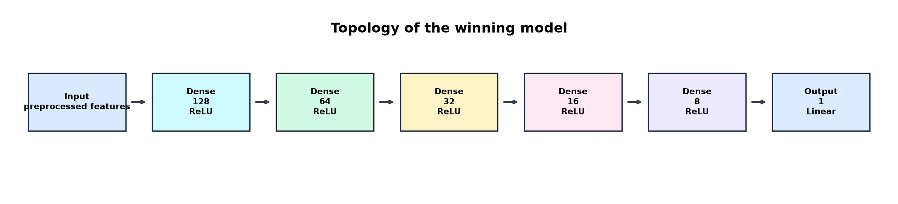
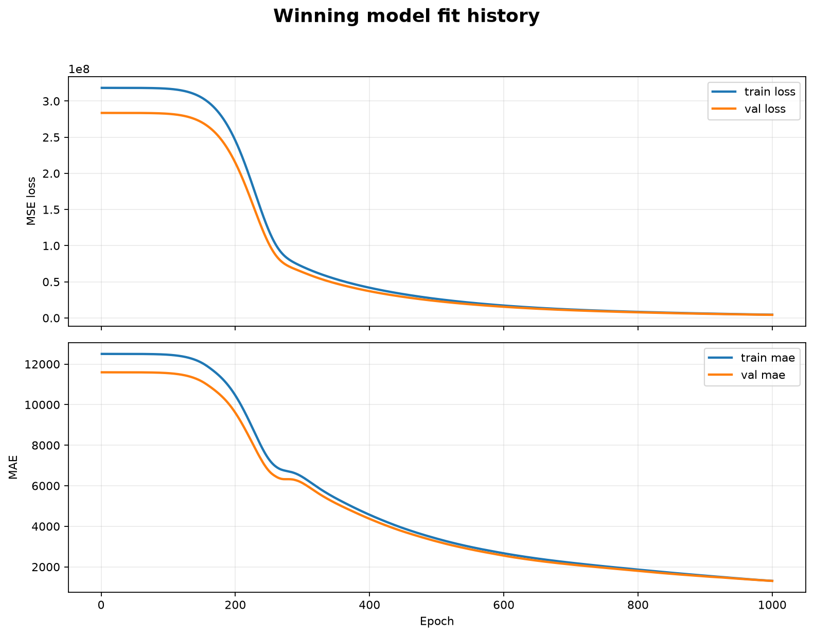

# Reporte del modelo ganador

Fecha de entrenamiento: 28 de julio de 2026

Este documento resume la corrida mas reciente del proyecto y documenta el modelo seleccionado por `rmse_valid`.

## Resumen ejecutivo

| Campo | Valor |
| --- | --- |
| Experimento ganador | `max-depth-8` |
| Run ganador | `1c8cde21da5440bb9a177e8c5a08fe35` |
| Run padre | `abfb8e5a13744fec9f0a2ba86eda1bf1` |
| Criterio de seleccion | `rmse_valid` |
| Arquitectura ganadora | `[128, 64, 32, 16, 8]` |
| Activacion capas ocultas | `relu` |
| Activacion de salida | `linear` |
| Epocas entrenadas | `1000` |
| Mejor epoca | `1000` |
| `best_valid_rmse` | `2065.3372` |
| `best_valid_mae` | `1306.8798` |
| `best_valid_r2` | `0.9714` |
| `test_rmse` | `2244.2237` |
| `test_mae` | `1401.9526` |
| `test_r2` | `0.9689` |
| Modelo registrado | `automobile-price-predictor` v4 |
| URI del modelo | `runs:/1c8cde21da5440bb9a177e8c5a08fe35/model` |

> Nota: la configuracion base del entrenamiento quedo en `epochs = 1000` y el experimento ganador `max-depth-8` tambien usa `epochs = 1000`. En esta corrida no hubo sobrescritura entre la configuracion base y el experimento.

## Comparacion con baseline

El baseline del mismo run usa la mediana de `y_train`.

| Medida | Baseline | Modelo ganador | Mejora relativa |
| --- | --- | --- | --- |
| RMSE validacion | `13154.2624` | `2065.3372` | `84.30%` |
| RMSE test | `13154.2624` | `2244.2237` | `82.94%` |
| MAE test | `9695.3248` | `1401.9526` | `85.54%` |

## Topologia seleccionada

La red ganadora es una MLP de regresion con:

- entrada con las variables ya preprocesadas;
- cinco capas ocultas densas;
- activacion `relu` en todas las capas ocultas;
- salida lineal de una sola neurona.



| Capa | Unidades | Activacion |
| --- | --- | --- |
| Entrada | variables procesadas | - |
| Dense 1 | `128` | `relu` |
| Dense 2 | `64` | `relu` |
| Dense 3 | `32` | `relu` |
| Dense 4 | `16` | `relu` |
| Dense 5 | `8` | `relu` |
| Salida | `1` | `linear` |

## Ajuste del modelo

El ajuste del modelo se observa en el historial de entrenamiento guardado por MLflow.



Comentarios:

- `loss` y `val_loss` bajan de forma sostenida durante toda la corrida.
- `best_epoch` coincide con la ultima epoca, por lo que no se detuvo antes por early stopping.
- La curva de validacion siguio mejorando hasta el final. Esto sugiere que la arquitectura mas profunda fue la mejor candidata dentro del espacio probado.

## Experimentos evaluados

| Experimento | Arquitecturas probadas | `best_valid_rmse` | `best_valid_mae` | `best_valid_r2` | `test_rmse` | `test_r2` |
| --- | --- | --- | --- | --- | --- | --- |
| `wide-128` | `[128]`, `[128, 64]` | `7525.9849` | `5327.0979` | `0.6204` | `7922.0415` | `0.6128` |
| `balanced-32` | `[128, 64]`, `[128, 64, 32]` | `2452.2860` | `1527.3710` | `0.9597` | `2680.9460` | `0.9557` |
| `deep-16` | `[128, 64, 32, 16]` | `2478.9981` | `1598.6163` | `0.9588` | `2678.8973` | `0.9557` |
| `max-depth-8` | `[128, 64, 32, 16, 8]` | `2065.3372` | `1306.8798` | `0.9714` | `2244.2237` | `0.9689` |

## Reproducibilidad

La corrida actual se ejecuto con:

```powershell
.\\.venv\\Scripts\\python.exe -m src.train
```

Tambien se puede ejecutar con el comando del proyecto si el entorno de `uv` esta configurado correctamente:

```powershell
uv run --python 3.13 automobile-train
```

Archivos relevantes:

- configuracion: [`../config/train.yaml`](../config/train.yaml)
- historial del ganador: `reports/final_training_history.json`
- resumen del experimento: `reports/experiment_summary.json`
- artefacto del modelo: `runs:/1c8cde21da5440bb9a177e8c5a08fe35/model`
